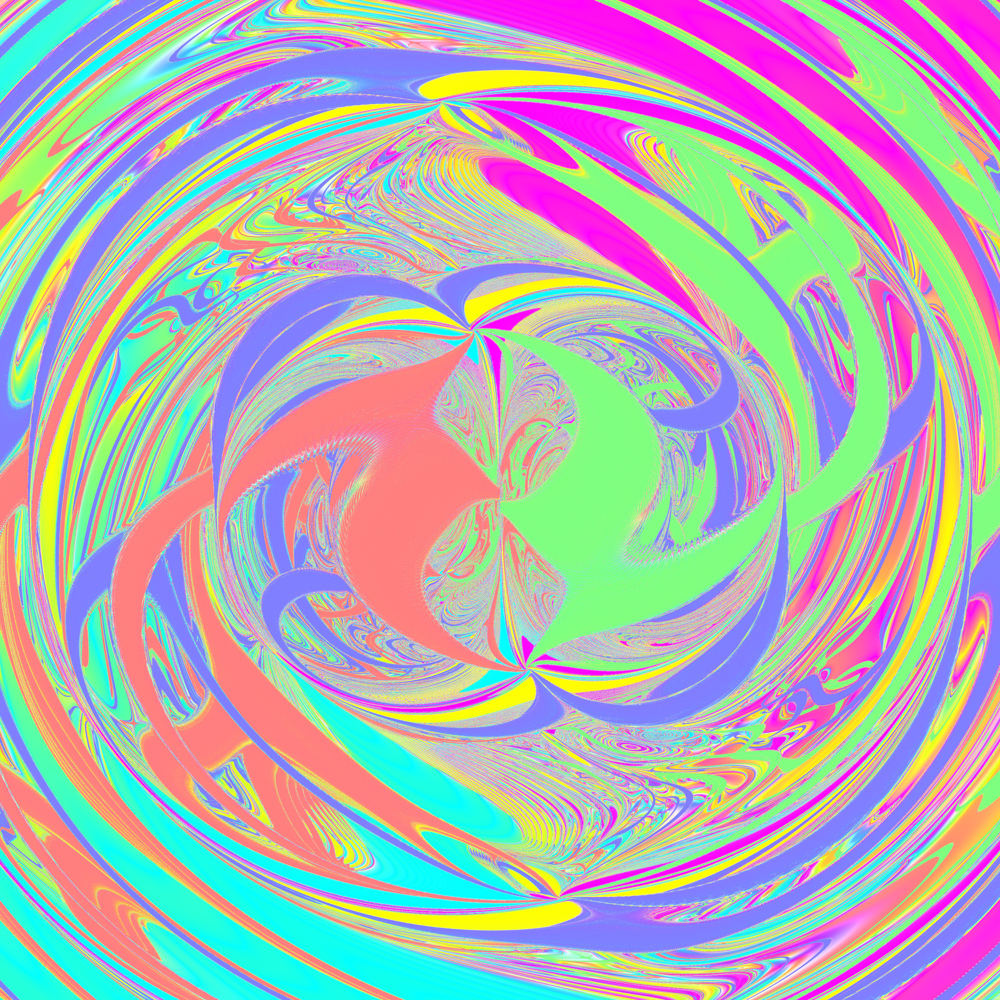
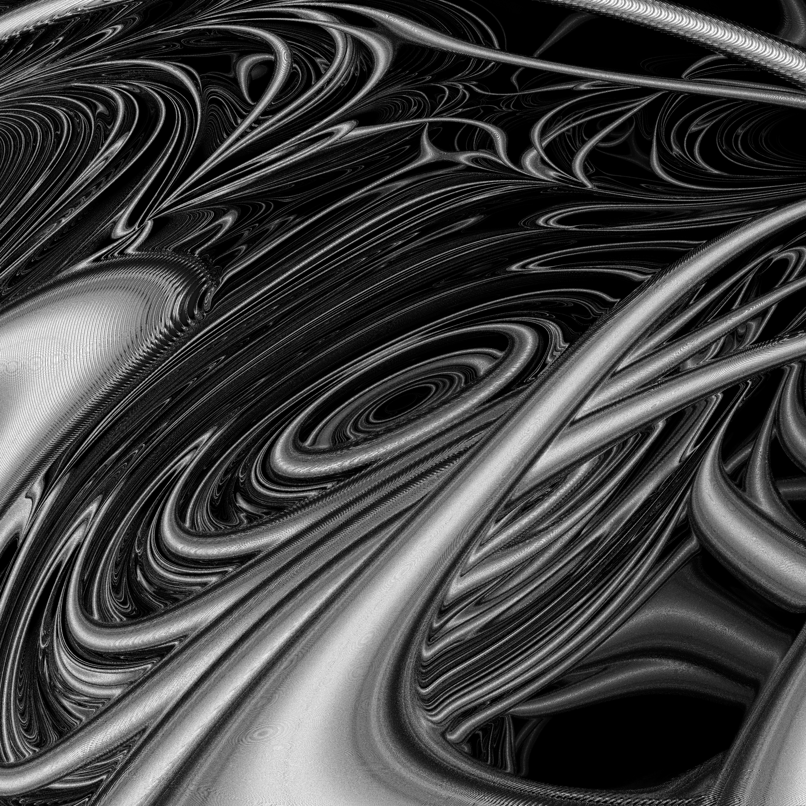
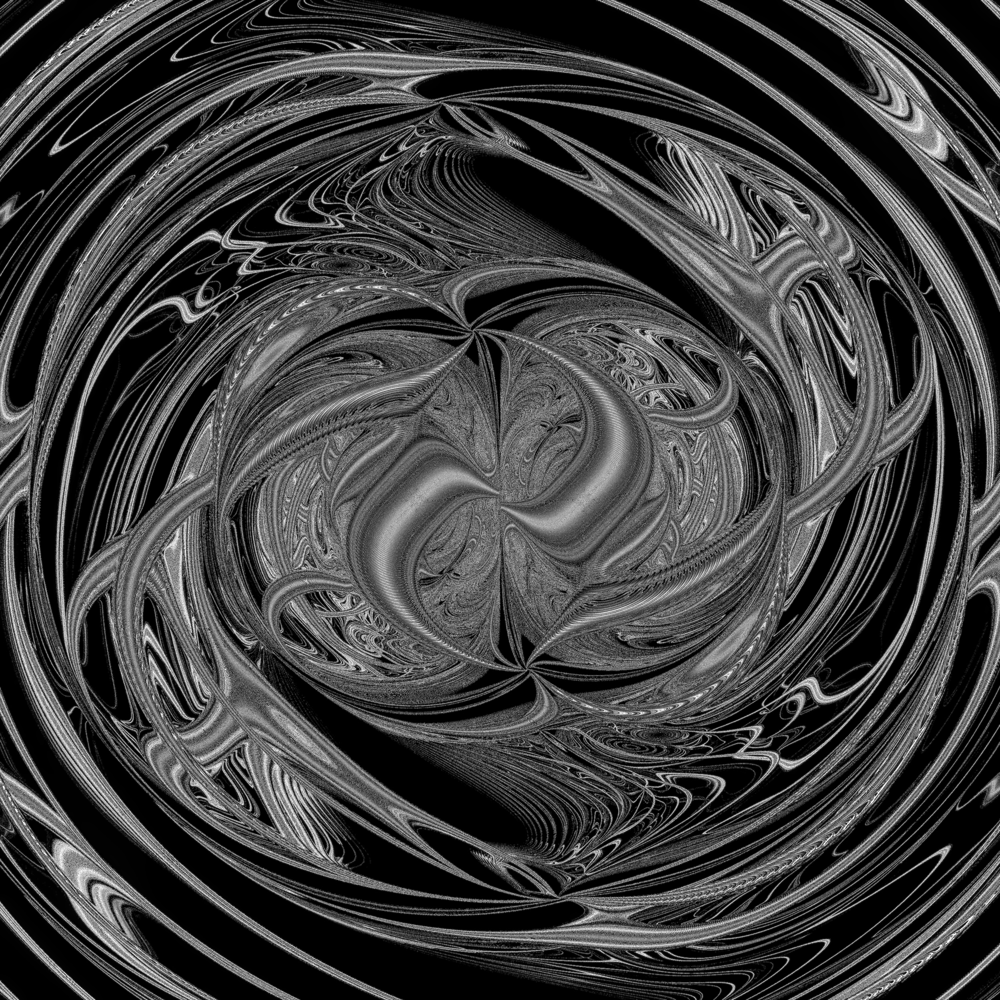
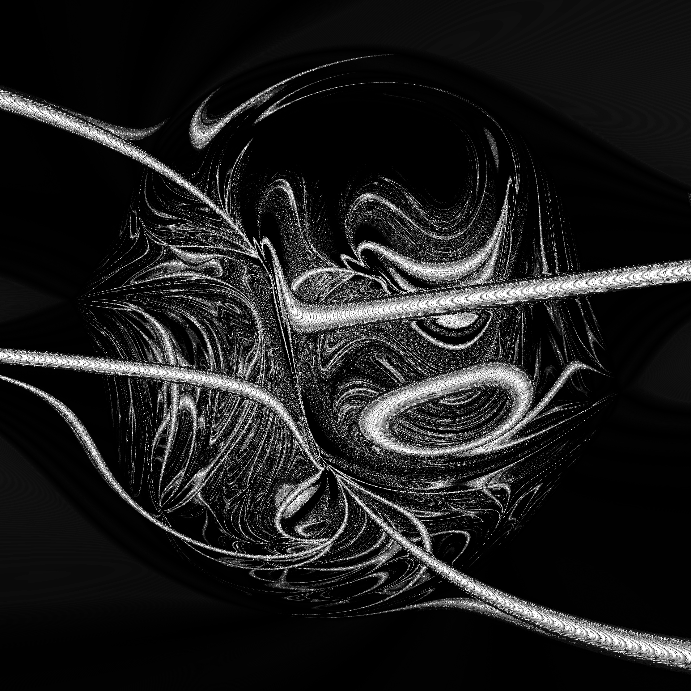
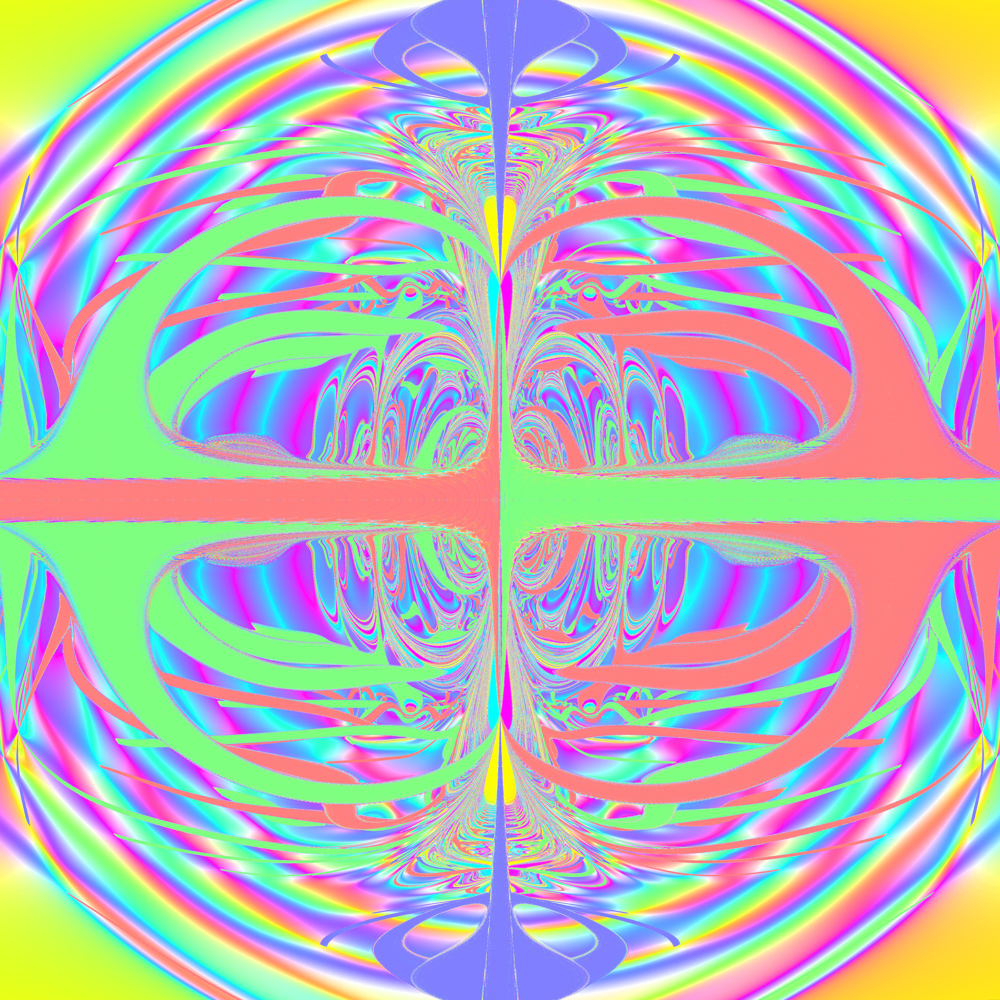
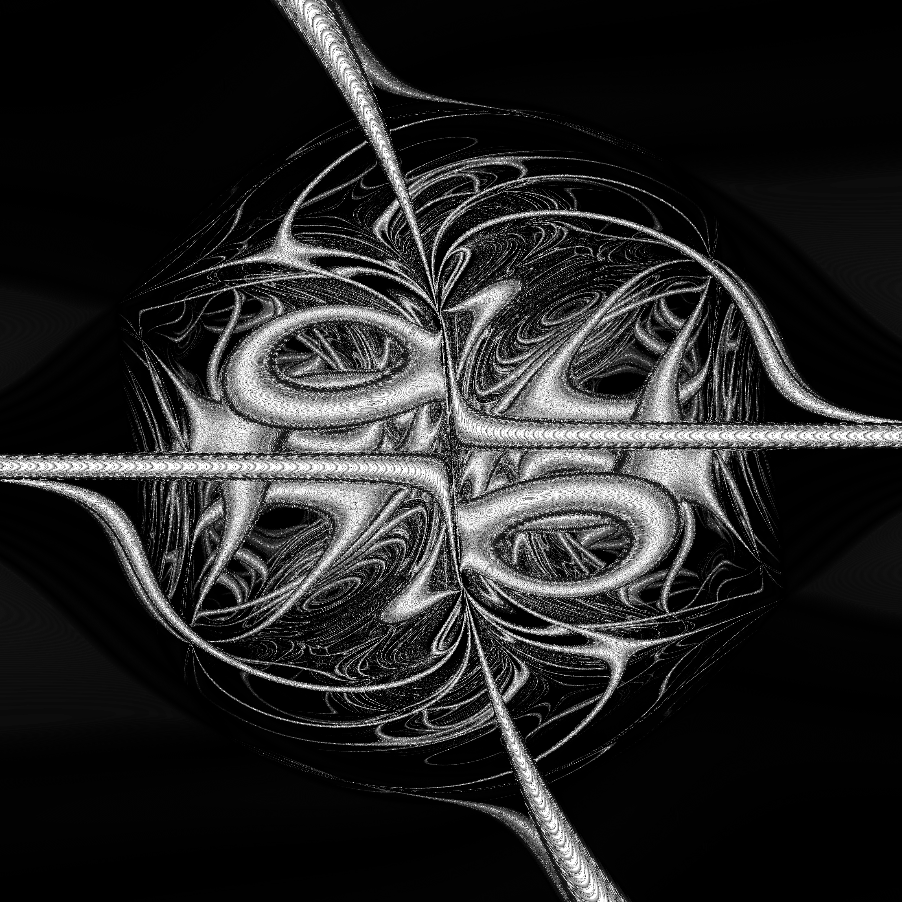
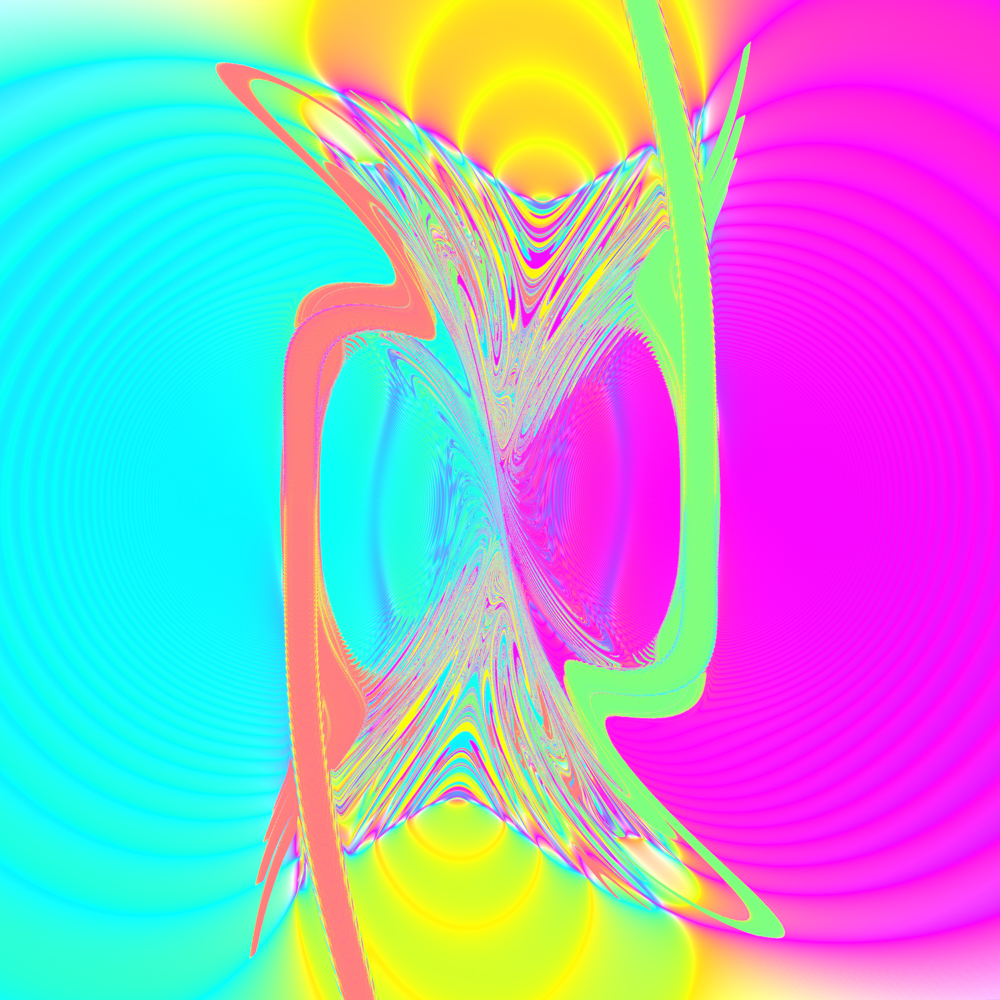

# Three-Body Input Space Visualization

A CUDA-accelerated visualization of the chaotic behavior of the three-body problem.

Instead of simulating a single set of initial conditions, this project evaluates a large grid of possible initial conditions and then maps the end state of each simulation to a color. This produces a visualization of a slice of the phase space of the three body problem.

## How It Works

* Initial states are created by mapping pixel position to the starting position or velocity of a body.
* Each state is then simulated for a set ammount of time using the Runge Kutta Dormand Prince method (This is the same method as ode45 in MATLAB).
* Dormand Prince gives a 4th and 5th order estimate, and the difference between the two can be used to estimate the error for each update.
* The error is then used to calculate a new time step size.
* Depending on if the error is within tolerance, the estimation is either applied or rejected, and the algorithm resumes with the new time step.
* Once each simulation has run for some set ammount of time, the final state is converted into a pixel color. Black and white images represent the ending step size (how difficult the state is to simulate), and color images represent the relative lengths of a triangle's legs formed with a point at each body.
## Results

## Motivation

The three-body problem is deterministic but can exhibit extremely sensitive dependence on initial conditions. This project explores that behavior computationally by treating the initial conditions themselves as the space being visualized, rather than simply plotting individual trajectories.
